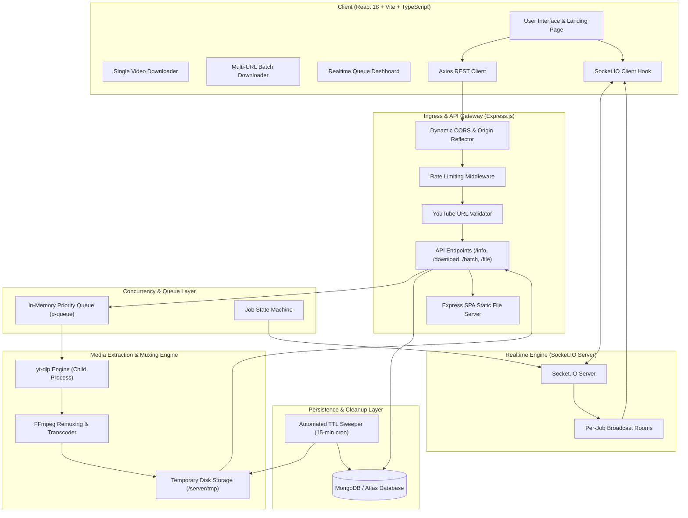
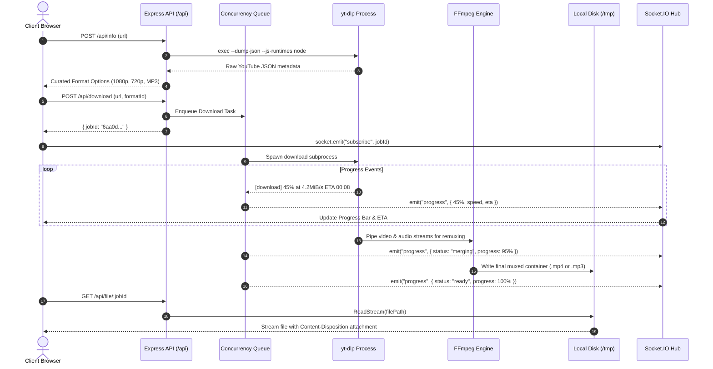
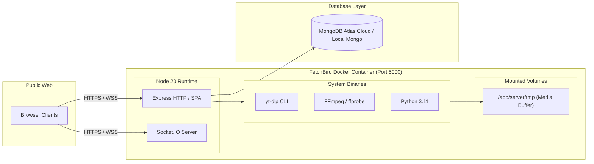

# FetchBird — Full System Architecture Document

**Version:** 1.2  
**Date:** September 2026  
**Stack:** MERN (MongoDB, Express, React, Node.js) + yt-dlp + FFmpeg + Socket.IO  

---

## 1. Executive Summary

FetchBird is a local-first YouTube media extraction and remuxing application designed to provide high-bitrate video (up to 1080p Full HD) and studio-grade audio (320kbps MP3) directly to users without cloud retention. The platform combines a reactive shadcn/ui frontend with a resilient Node.js orchestration engine that manages asynchronous child processes (`yt-dlp`, `ffmpeg`), real-time WebSocket streams, in-memory concurrency queues (`p-queue`), and self-healing storage.

---

## 2. System Architecture Diagram



---

## 3. Layered Architectural Breakdown

### 3.1 Presentation Layer (Frontend)
- **Framework**: React 18, Vite 5, TypeScript 5.
- **Styling System**: Tailwind CSS v3 with CSS variables tailored to a minimal neutral shadcn/ui palette with a vibrant cobalt blue accent (`hsl(221 83% 53%)`).
- **State & Caching**:
  - `TanStack Query (React Query)`: Handles declarative fetching, caching, and cache invalidation for video metadata.
  - `useSocket` & `useMultiSocket`: Custom hooks managing persistent WebSocket lifecycle, channel subscriptions, and state updates per job.
- **Key Modules**:
  - [`UrlInput.tsx`](client/src/components/UrlInput.tsx): Single-video input with clipboard paste and drag-and-drop validation.
  - [`BatchUrlInput.tsx`](client/src/components/BatchUrlInput.tsx): Multiline text input for up to 10 concurrent YouTube links.
  - [`FormatSelector.tsx`](client/src/components/FormatSelector.tsx): Curated dropdown distinguishing FFmpeg-muxed video (1080p, 720p, 480p) from high-bitrate MP3 audio.
  - [`QueueManager.tsx`](client/src/components/QueueManager.tsx): Live processing dashboard with progress bars, speeds, ETAs, and bulk sequential download triggers.

---

### 3.2 Ingress & Realtime Communication Layer
- **HTTP Server**: Node.js `http` wrapped with Express 4.
- **WebSocket Protocol**: Socket.IO v4 with WebSocket and long-polling fallbacks.
- **Room-Based Broadcast Architecture**:
  1. Client emits `socket.emit("subscribe", jobId)`.
  2. Server binds the connection to room `jobId`.
  3. Processing tasks emit events strictly to that room:
     ```typescript
     io.to(jobId).emit("progress", { jobId, status, progress, speed, eta });
     ```
  4. Reduces network overhead and prevents cross-client data leakage.
- **Dynamic CORS**: Middleware dynamically reflects incoming origins from local environments, custom domains, and cloud domains (`*.onrender.com`, `*.railway.app`).

---

### 3.3 Concurrency & Queue Architecture (`p-queue`)
To prevent CPU starvation and out-of-memory (OOM) crashes caused by simultaneous FFmpeg muxing jobs:
- **Queue Engine**: `p-queue` in-memory queue.
- **Concurrency Limit**: Controlled by `MAX_CONCURRENT_DOWNLOADS` (default `2` locally, `1` on 512MB RAM free cloud instances).
- **Execution Lifecycle**:
  1. User triggers single or batch download.
  2. A MongoDB `Job` record is created in status `pending`.
  3. Job task is enqueued in `p-queue`.
  4. When an execution slot opens, status transitions to `downloading`.
  5. During audio/video stream combining, status shifts to `merging`.
  6. Upon completion, file path is verified on disk and marked `ready`.

---

### 3.4 Media Extraction & Remuxing Pipeline



#### Windows & Linux File Locking Prevention:
- Windows throws `[WinError 32]` when yt-dlp attempts intermediate renames from `.temp.mp4` to `.mp4`.
- **Solution**: The output template uses `path/to/jobId_title.%(ext)s`. This allows FFmpeg to write directly to the destination container without intermediate collision.
- The `downloadToFile` function returns a `Promise<string>` that resolves to the exact file path confirmed on disk.

---

### 3.5 Persistence & Self-Cleaning Storage

#### MongoDB Job Schema:
```typescript
interface IJob {
  url: string;                  // YouTube URL
  title?: string;              // Sanitized video title
  thumbnail?: string;          // Poster image URL
  formatId: string;            // yt-dlp format identifier
  status: "pending" | "downloading" | "merging" | "ready" | "failed";
  progress: number;            // 0 to 100
  filePath?: string;           // Absolute disk path
  errorMessage?: string;       // Failure explanation if any
  createdAt: Date;             // Auto-timestamp
}
```

#### Dual Cleanup Mechanism:
1. **Database Level**: MongoDB native TTL index automatically purges records after `FILE_TTL_MINUTES`.
2. **Filesystem Level**: Background cron scheduler running every 15 minutes:
   - Scans `server/tmp/`.
   - Identifies orphaned files (`.mp4`, `.mp3`, `.part`, `.temp`).
   - Deletes files whose `mtime` exceeds `FILE_TTL_MINUTES` (default 60 mins locally, 30 mins cloud).

---

## 4. API Specification

| Method | Endpoint | Description | Request Body / Params | Response |
|---|---|---|---|---|
| `POST` | `/api/info` | Inspect single video metadata | `{ "url": string }` | `{ id, title, thumbnail, duration, channel, formats }` |
| `POST` | `/api/download` | Enqueue single video download | `{ "url", "formatId", "title", "ext" }` | `{ "jobId": string }` |
| `POST` | `/api/batch-info` | Concurrently inspect up to 10 URLs | `{ "urls": string[] }` | `{ "results": [{ url, success, info, error }] }` |
| `POST` | `/api/batch-download` | Enqueue batch video items | `{ "items": [{ url, formatId, title, ext }] }` | `{ "jobs": [{ jobId, url, title, formatId }] }` |
| `GET` | `/api/status/:jobId` | Polling fallback for job status | `:jobId` in path | `{ jobId, status, progress, title, errorMessage }` |
| `GET` | `/api/file/:jobId` | Stream completed media file | `:jobId` in path | Binary Stream (`audio/mpeg` or `video/mp4`) |
| `GET` | `/health` | Server liveness probe | None | `{ "status": "ok", "service": "FetchBird Server" }` |

---

## 5. Security & Reliability

1. **Injection Prevention**:
   - YouTube URLs are validated against hostname regex (`youtube.com`, `youtu.be`).
   - Command arguments to `yt-dlp` and `ffmpeg` are strictly passed as sanitized arrays (`child_process.execFile` semantics) rather than string interpolation, preventing arbitrary shell command injection.
2. **Rate Limiting**:
   - `express-rate-limit` throttles excessive requests per IP window.
3. **Resilient Download Recovery**:
   - If a job record is lost (e.g. server restart with in-memory database), `/api/file/:jobId` scans the temporary directory for physical files matching `${jobId}_*` and serves them with full RFC 6266 filename headers.
4. **Single-Container Monolith**:
   - In production (`NODE_ENV=production`), Express automatically serves the built React SPA from `client/dist`. Both UI and API reside on the same origin, eliminating cross-origin complications.

---

## 6. Deployment Architecture



---

## 7. Directory Structure

```
FetchBird/
├── client/                     # Frontend Application
│   ├── src/
│   │   ├── components/         # UI Components (Batch, Queue, Single, Landing)
│   │   ├── hooks/              # Socket.IO and Query Hooks
│   │   ├── lib/                # API client & Tailwind utilities
│   │   ├── pages/              # Main Landing Page (Home.tsx)
│   │   └── providers/          # ThemeProvider (Dark / Light)
│   ├── index.html              # HTML shell with typography links
│   └── vite.config.ts          # Vite build & proxy config
│
├── server/                     # Backend Application
│   ├── src/
│   │   ├── config/             # MongoDB connection & fallback
│   │   ├── middleware/         # Rate limiting & URL validation
│   │   ├── models/             # Mongoose Job Schema
│   │   ├── routes/             # Express routes (info, download, batch, file)
│   │   ├── services/           # yt-dlp, FFmpeg, p-queue, cleanup scheduler
│   │   ├── sockets/            # Socket.IO progress room emitter
│   │   ├── app.ts              # Express application configuration
│   │   └── server.ts           # Server bootstrap & graceful shutdown
│   └── bin/                    # Local yt-dlp binary cache
│
├── deploy/                     # Production Deployment Configurations
│   └── nginx.conf              # Reverse proxy configuration with WebSocket upgrade
├── Dockerfile                  # Multi-stage production container build
├── docker-compose.yml          # Complete stack with MongoDB
├── .dockerignore               # Container build exclusion rules
├── .gitignore                  # Git repository exclusion rules
└── README.md                   # Project documentation & quick start
```

---

*Authored by Antigravity for FetchBird Media Engine.*
